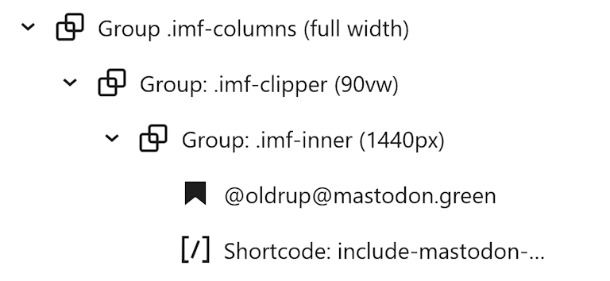

# A bit of CSS makes a pretty column layout

*Optional styling of Mastodon feeds by @oldrup. For the full blog post with sample feeds visit https://oldrup.dk/en/include-mastodon-feed/*

As the HTML output provided by the Include Mastodon Feed plugin has good semantics, meaningful class names, and useful custom properties, let’s hit that inspect button, and see what we can do with pure CSS. 
## How to build the block structure and the shortcode attributes or Mastodon block settings
  
To enable the column layout, add two *nested* group blocks (three if you fancy the tilted and clipped layout), assign the classes and add the shortcode (or Mastodon Feed block) to the inner block. You can play around with the content width, but I’ve added some recommended starting points to the recipe below:

1. Create container **group** with class `imf-colums` (full width)
2. Optional: Create clipping **group** with class `imf-clipper` (90vw)
3. Create inner **group** with class `imf-inner` (1440–1920px)
4. Add **heading** and insert **Include Mastodon Feed shortcode** or Block
### Sample container group structure

### Or just import the included block pattern
The file [group-imf-columns-full-width.json](/assets/imf-columns/group-imf-columns-full-width.json) contains a sample pattern you can add in the WordPress dashboard in **Appearance > Design > Patterns > Add Pattern > Import Pattern from JSON**

You should then be able to find the **Group imf-columns (full width)** pattern in the block inserter which can be used as a starting point for your own layout.
### What attributes to use in the shortcode?

The appropriate attributes for the Include Mastodon Feed shortcode, depends on your use case. The goal of _this_ little CSS project, is to show visual content in a “pinteresque style”, filtering out most text, but obviously linking to the original post’s creator. 

| Attribute                          | Reason                                |
| ---------------------------------- | ------------------------------------- |
| excludeReplies=”true”              | Only show original status, no replies |
| excludeConversationStarters=”true” | Ignore statuses directed at someone   |
| onlyMedia=”true”                   | Only return status with media         |
| preserveImageAspectRatio=”true”    | Show original aspect ratio, no crop   |
| imageSize=”preview”                | “Low-res” images, _very_ important    |
| imageLink=”status”                 | Clicking the image leads to status    |
| showPreviewCards=”false”           | Not supported by this styling         |
| hideStatusMeta=”true”              | If showing your own account only      |

## How to add the imf-columns stylesheet

With the block structure and shortcode in place, all we need to enable the column layout, is to add the stylesheet to the website. Use any preferred custom CSS plugin or your theme’s ability to add custom CSS, and include the file [imf-columns.css](/assets/imf-columns/imf-columns.css)

The  CSS provides the three classes `.imf-columns`, `.imf-clipper` and `.imf-inner` as well as a set of CSS custom properties to tweak the design of the posts.

- We use [CSS columns](https://developer.mozilla.org/en-US/docs/Web/CSS/columns), meaning the `--imf-column-width` is the _minimum_ width, and `--imf-column-count` is the _maximum_ number of columns; the browser will fit in a number of columns within these constraints.
- All _my_ custom properties are prefixed `--imf`
- The _plugin_ custom properties are prefixed `--include-mastodon-feed`

That's it! The styling is quite opinionated out of the box, but most settings can be adjusted using the --imf properties at the top. There are some optional CSS rules at the bottom that adjust number of statuses on mobile, and that fades in statuses to reduce layout shift. 